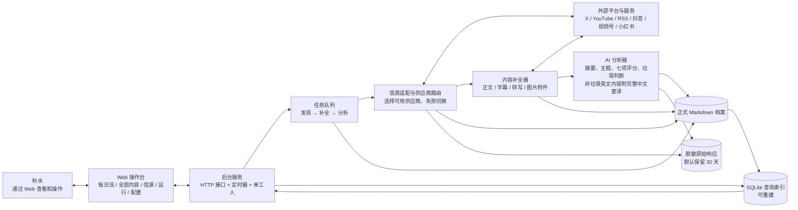
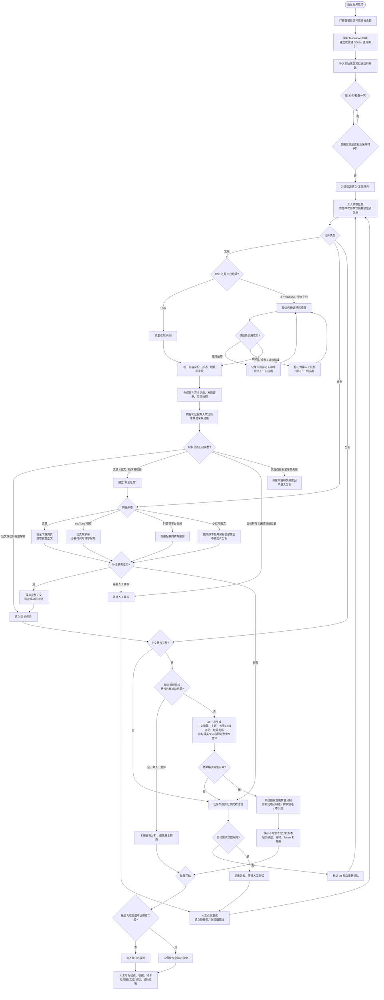
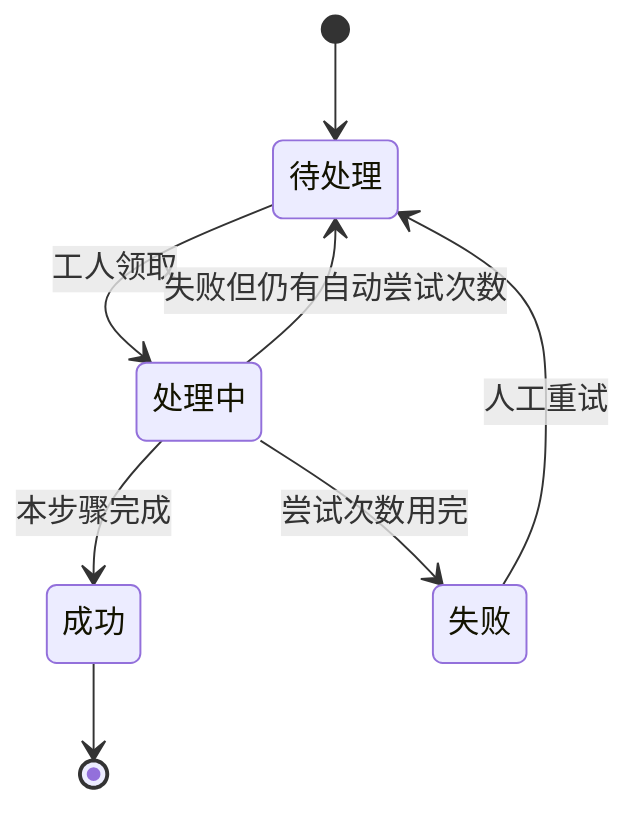
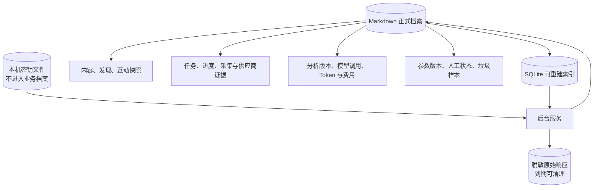

# qiushuiai-airadar 运行架构与完整处理流程

> 本文依据 2026-09-16 的当前代码编写，描述的是“现在实际怎样运行”，不是未来设想。
>
> 一句话理解：qiushuiai-airadar 像一条内容加工流水线——先去各个平台找新内容，再补齐正文、字幕或图文附件，最后交给 AI 做摘要和评分，合格内容才进入每日内容流。

## 1. 先看懂整套系统

可以把系统想成一家小型快递加工站：

- **信源**是长期订阅的发货人，例如 OpenAI 的 X 账号、YouTube 频道或 RSS。
- **供应商**是取件员，例如 TwitterAPI.io、TikHub、Google YouTube API。
- **任务队列**是待办单，按“发现、补全、分析”三类排队。
- **后台服务**是调度员，定时开单并逐张处理。
- **Markdown 文件**是正式档案，保存内容、任务、分析和错误证据。
- **SQLite**只是加速查找的目录，损坏后可以根据 Markdown 重新生成。
- **Web 页面**是操作台，用来查看结果、重试失败内容、调整参数和提供人工反馈。

## 2. 总体运行架构图



### 每个部分负责什么

| 部分 | 通俗说明 | 当前实现位置 |
| --- | --- | --- |
| Web 操作台 | 只展示和发操作指令，不直接拿平台密钥 | `apps/web` |
| 后台服务 | 启动定时采集、提供接口、驱动任务 | `apps/service` |
| 内容流水线 | 发现、补全和 AI 分析的具体规则 | `packages/pipeline` |
| 平台接头 | 把不同平台返回的数据翻译成统一格式 | `packages/source-adapters` |
| 运行仓库 | 保存任务、内容、分析、进度和恢复证据 | `packages/runtime` |
| 领域契约 | 约定信源、内容形态和任务等共同语言 | `packages/domain`、`CONTEXT.md` |

## 3. 完整执行流程图

下面这张图从服务启动一直画到内容处理完结，并包含失败、等待人工和重试分支。



## 4. 每一步到底发生了什么

### 第 0 步：服务恢复现场

服务启动时先打开数据目录。Markdown 文件是正式记录；SQLite 是为了让页面快速查询的索引。如果索引损坏，系统会删除损坏索引并从 Markdown 重建。

如果上次服务突然退出，原来处于“运行中”的任务会恢复成“待处理”，避免永远卡住。一个数据目录同一时间只允许一个服务实例使用。

### 第 1 步：定时器创建发现任务

服务每 30 秒查看一次所有**启用信源**。默认采集时间是每天 08:00，使用运行机器的本地时间。

- 第一次采集：只看最近 7 天，最多接收 20 条。
- 后续采集：从上次进度继续，每轮最多接收 100 条。
- 同一信源同一分钟重复触发，只会得到同一张任务单，不会重复采集。
- 当前正式服务只有 1 个工人，所以所有任务实际上是逐个处理，不是同时处理。

### 第 2 步：领取任务并冻结参数

工人领取任务时，会把当时生效的参数完整拍一张“快照”。之后即使秋水修改配置，正在运行的任务也继续使用旧快照；新配置只影响以后领取的任务。

同一信源还会加锁，避免同一时间出现两次相互覆盖的进度更新。

### 第 3 步：选择采集供应商

RSS 由系统直接读取。其他平台按以下顺序尝试已经配置密钥的供应商：

| 信源类型 | 当前顺序 |
| --- | --- |
| X | TwitterAPI.io → TikHub |
| YouTube | Google Data API → TikHub |
| RSS | 原生 RSS |
| 抖音 | TikHub → Get笔记 |
| 视频号 | TikHub |
| 小红书 | TikHub |

临时错误或限流会让供应商默认冷却 30 分钟；密钥、余额或请求配置错误会要求人工恢复。系统会在本轮预算内继续尝试下一个供应商，并保存每次尝试的耗时、结果和脱敏错误。

### 第 4 步：统一身份并去重

不同平台返回的数据长得完全不同，系统先把它们翻译成统一的“内容”。去重不看标题，而看稳定的平台身份或规范地址。

X 比较特殊：一条帖子可能同时带文章、视频和普通文字。系统只选一个主载体，顺序是：YouTube 外链 → X Article → 外部文章 → X 原生视频 → X 短文。X 帖子本身仍作为“在哪里发现它”的证据保留。

因此，同一个 YouTube 视频即使从 X 和 YouTube 两处发现，仍然只保留一条内容主记录，但会有多条发现记录和互动快照。

### 第 5 步：先落档，再推进采集进度

系统先保存：

1. 内容主记录；
2. 发现记录；
3. 当时取得的浏览、点赞、评论、转发、收藏快照；
4. 脱敏后的供应商响应；
5. 下一次从哪里继续的采集进度。

最重要的顺序是：**内容和发现证据写成功以后，采集进度才能向前走。** 这样即使中途断电，也不会出现“进度已经过去，但内容没有保存”的丢件情况。

### 第 6 步：判断是否需要补全

只有完整材料才能进入 AI 分析：

| 内容形态 | 完整材料是什么 | 不完整时怎么办 |
| --- | --- | --- |
| 短文 | 完整帖子或帖子串文字 | 帖子串不完整时暂不继续 |
| 文章 | 从网页提取的完整正文，至少达到完整性门槛 | 建立补全任务 |
| YouTube 视频 | 平台字幕或完整转写 | 等人工转写，或在允许时自动转写 |
| 抖音、视频号等视频 | 完整转写；需要时还要有关键画面识别 | 等人工转写，或在允许时自动转写 |
| 小红书图文 | 平台正文、全部原图和正确顺序 | 正文为空或任一图片缺失都算失败；图片不送给大模型分析 |

自动转写默认关闭。开启后，也只自动处理不超过 120 分钟且已知时长的视频；其余内容进入“等待人工转写”。

### 第 7 步：保存并冻结完整正文

补全成功后，系统保存正文、字幕、原始图文附件和必要媒体证据。图文图片不送给大模型识别，图文只使用平台提供的正文进行后续分析。正文首次成功后冻结，之后再次发现同一内容，不会偷偷改正文或自动重算历史结果。

文章还会在补全后根据最终规范地址再次合并身份，避免跳转地址和跟踪参数制造重复内容。

### 第 8 步：AI 分析

分析前，系统先计算“分析指纹”，它由正文、个人画像版本、评分规则版本、模型路线版本和提示词版本组成。

- 指纹相同且已有成功结果：直接复用，不再次调用模型。
- 人工明确要求重新分析：允许创建新版本，但旧版本继续保留。
- 指纹不同：调用当前固定模型 `gpt-5.6-terra`。

模型一次返回中文摘要、主题、七项 1～5 档评分以及垃圾判断。对于**英文信源的非垃圾内容**，这同一次调用还会返回中文标题和完整正文意译，覆盖 X 短帖、X 长文、YouTube 字幕和 RSS 文章。垃圾内容不要求意译；需要意译却缺少中文标题或正文时，本次分析算失败。英文原文始终保留。旧数据会排队补译，完成前仍会显示“未意译”。

### 第 9 步：算总分并决定进入哪里

系统把每项 1～5 档换算成 0、25、50、75、100，再按权重计算百分制总分：

| 分项 | 默认权重 |
| --- | ---: |
| 主题匹配 | 20% |
| 实质性 | 15% |
| 可信度 | 15% |
| 新颖性 | 10% |
| 可操作性 | 15% |
| 工作价值 | 15% |
| 清晰完整性 | 10% |

推荐结果有三种：

- **核心精选**：总分至少 80，主题匹配为 5，实质性和可信度都不低于 3。
- **探索候选**：总分至少 60，主题匹配至少 4，实质性和可信度都不低于 3。
- **不进入每日流**：未达到门槛，或被 AI / 人工判为垃圾。

平台热度、博主名气、内容长短和互动量目前都不额外加分。

### 第 10 步：处理完结与人工使用

代码对“处理完结”的判定很明确：**正文补全成功，并且至少存在一份成功分析记录。**

“处理完结”不等于“必须进入每日流”：

- 核心精选、探索候选且非垃圾：出现在每日内容流。
- 分数不足或垃圾：仍保留在全部内容中，方便追溯。
- 已读、收藏、转卡片、转视频、转文章、转项目、人工标垃圾：这些是后续人工状态，不会改写处理结果。

目前没有单独的“投递任务”。每日流是在 Web 请求 `/api/daily` 时，根据已经保存的处理结果即时筛选出来的。

## 5. 失败与恢复怎么工作



- 默认任务最多尝试 3 次，每次失败后默认等 30 秒再排队。
- 平台发现任务由供应商路由器自己管理最多 3 次供应商尝试，外层任务不会再重复消耗一轮预算。
- 一条内容补全失败，不会删除已经发现的内容，也不会阻塞其他内容。
- 错误会脱敏后保存，密钥、Token、Cookie 等不能进入任务、内容、分析或前端接口。
- 人工重试会建立一张新任务单，之前的失败记录继续保留。
- 服务崩溃后，运行中的任务会在下次启动时重新回到待处理状态。

## 6. 数据保存与恢复架构



默认数据根目录是 `~/.qiushuiai-airadar/development-data`：

- Markdown：正式、可阅读、可重建的业务证据。
- `.index/runtime.sqlite`：页面查询和任务领取的加速索引，不是唯一真相。
- `.raw-responses`：已脱敏的供应商和模型原始返回，默认 30 天后清理。
- `~/.qiushuiai-airadar/development-data/.env`：密钥文件，与业务数据分开。

## 7. 当前代码已经实现的范围

- 六类信源：X、YouTube、RSS、抖音、视频号、小红书。
- 定时增量采集、首次有限回看、断点续采。
- 多供应商优先级、失败切换、冷却和人工恢复状态。
- 内容身份去重、X 主载体选择、跨平台同作品关联。
- 文章正文提取、视频字幕或转写、图文原始附件保存；不进行图片分析。
- 完整性门禁：材料不完整不能分析。
- AI 摘要、主题、七项评分、垃圾判断和推荐分层；英文信源的非垃圾内容另有中文标题与完整正文意译。
- 分析去重、人工重算版本、模型调用及费用证据。
- 任务自动重试、人工重试、崩溃恢复和参数版本回退。
- 每日流、全部内容、已读、利用动作和人工垃圾反馈。

## 8. 当前实现边界与风险

这些不是流程图遗漏，而是当前代码的真实边界：

1. **正式服务目前是单工人。** `concurrency` 固定为 1，所以即使不同信源理论上可以并行，当前也会逐张任务处理。内容积压时吞吐量有限。
2. **页面“试抓”不是正式采集。** 它最多预览 3 条，只验证连接和样品，不保存内容，也不推进采集进度。正式完整采集目前依赖定时计划。
3. **非 RSS 的采集审计还不完整。** 平台采集会保存每次供应商尝试、供应商健康和进度，但当前没有像 RSS 那样写入统一的“采集运行审计”。信源页面又主要根据统一审计判断健康，因此非 RSS 的健康展示可能缺少完整依据。
4. **“不可用信源”只体现在页面计算。** 页面会把连续 3 次采集失败显示为不可用，但当前代码不会自动把信源状态改为停用或归档。
5. **自动转写依赖外部服务。** 除已接入的抖音 Get笔记路径外，其他无字幕视频需要配置 `QIUSHUIAI_AIRADAR_TRANSCRIBER_URL`，否则会等待人工处理或失败。
6. **分析模型路线目前写死。** 正式服务固定使用 `gpt-5.6-terra`；配置页可以调整画像和评分，但不能切换模型路线。
7. **没有独立投递队列。** “进入每日流”是查询时筛选，不是一个可单独追踪和重试的投递步骤。
8. **另有一个 RSS 一次性流水线函数。** `runRssPipeline()` 主要被测试和验收脚本使用；正式后台服务走的是“发现任务 → 补全任务 → 分析任务”，两者不要混为一套生产流程。

## 9. 如何判断一条内容停在了哪里

| 页面状态 | 实际含义 | 下一步 |
| --- | --- | --- |
| 处理中 | 正在等待或执行补全 / 分析任务 | 通常无需操作 |
| 待人工转写 | 没有字幕，且自动转写未启用、不可用或视频过长 | 人工点击重试并提供可用转写能力 |
| 失败 | 某张任务的自动尝试已用完 | 查看运行记录后人工重试 |
| 已完成 | 完整正文和成功分析都已经保存 | 查看推荐级别和摘要 |
| 已完成但不在每日流 | 分数不足，或 AI / 人工判为垃圾 | 可在全部内容中追溯 |

## 10. 一条内容到底有哪些属性

先分清两件事：**原文**是采集或补全得到的材料，**摘要和意译**是 AI 后来生成的结果。页面通过 `/api/contents` 和 `/api/daily` 拿到下面这份“内容卡片数据”。下表列出了接口中一条内容的全部顶层属性；带 `?` 的属性可能没有，数字 `0` 也可能只是“尚未评分”，不是实际得了零分。

| 属性名 | 通俗名称与用途 |
| --- | --- |
| `id` | 内容身份证；去重、查看详情和人工操作都靠它定位同一条内容。 |
| `title` | 原始标题；普通帖子通常是平台给出的标题或正文节选，可能仍是英文。 |
| `chineseTitle?` | 非垃圾英文内容的中文标题；有值时列表和详情优先展示。 |
| `url?` | 原文链接；用于跳回平台查看。 |
| `publishedAt?` | 原文发布时间；平台没有给出时为空。 |
| `discoveredAt?` | 系统第一次发现它的时间。 |
| `firstInflowAt?` | 第一次达到“核心精选”或“探索候选”门槛的时间；从历史分析记录推算。 |
| `body` | 完整原文；短帖是帖子文字，文章是提取后的正文，视频通常是字幕或转写。没有补全时可能为空。 |
| `summary` | 用于快速了解内容的中文摘要；分析前暂用原文片段或等待/错误提示，**不是完整翻译**。 |
| `originalLanguage` | 原文语言：`zh` 中文、`en` 英文、`unknown` 暂无法可靠判断；先依据正文识别，难以识别时参考信源的语言设置。 |
| `chineseTranslation?` | 非垃圾英文内容的完整中文意译，与摘要分开保存；列表预览和详情优先显示它。 |
| `translatedToChinese` | 是否已有中文意译；英文内容为 `true` 才代表已翻译，`false` 代表尚未翻译。 |
| `topics` | AI 提炼的主题标签，可有多个；未分析时为空列表。 |
| `scores` | 七项评分，每项含 `level`（1～5 档）和 `reason`（评分理由）；未分析时为空。七项分别是 `topicMatch` 主题匹配、`substance` 实质性、`credibility` 可信度、`novelty` 新颖性、`actionability` 可操作性、`workValue` 工作价值、`clarity` 清晰完整性。 |
| `totalScore` | 系统按七项权重算出的百分制总分；未分析时接口暂给 `0`。 |
| `recommendation` | 推荐级别：`core` 核心精选、`explore` 探索候选、`none` 不入每日流。 |
| `analyzedAt?` | 最近一次成功分析的时间。 |
| `kind?` | 内容形态：`short_post` 短文、`article` 文章、`video` 视频、`image_post` 图文。 |
| `source?` | 来自哪个信源；里面有 `id` 信源编号、`name` 显示名称、`type` 平台类型、`language` 内容语言。当前信源统一设为英文。 |
| `images?` | 图文图片列表；每张有 `url` 图片地址，可能有 `order` 顺序。没有图片时不提供。 |
| `video?` | 视频信息；可能有 `durationSeconds` 时长（秒）、`thumbnailUrl` 封面地址、`mediaUrl` 视频地址。 |
| `processStatus` | 当前处理进度：`processing` 处理中、`completed` 已完成、`failed` 失败、`waiting-manual-transcription` 等待人工转写。与推荐级别是两回事。 |
| `originalStatus?` | 平台原帖状态，例如已删除或仅私密可见；只有拿到这类信息时才有。 |
| `read` | 是否已被人工标为已读。 |
| `utilizationActions` | 后续打算怎样使用，可包含 `favorite` 收藏、`card` 做卡片、`video` 做视频、`article` 写文章、`project` 建项目。 |
| `junk` | 当前是否算垃圾内容：`isJunk` 是/否，`source` 表示 AI 判断、人工决定或无，`reason?` 是原因，`note?` 是人工备注；人工决定优先。 |
| `evidence?` | 发现这条内容时的平台证据，例如发现地址、主载体类型、字幕状态；不同平台可提供的项目不同。 |
| `interaction?` | 最近一次互动快照：`capturedAt` 采集时间，以及 `views` 浏览、`likes` 点赞、`comments` 评论、`shares` 转发、`saves` 收藏；拿不到的计数为 `null`，不是零。 |
| `analysis?` | 最近一次成功分析的来源信息：`provider` 模型服务商、`model` 模型名、`profileVersionId` 个人画像版本、`ruleVersion` 评分规则版本。 |

页面列表与详情优先显示 `chineseTitle` 和 `chineseTranslation`；详情仍可展开查看 `title` 和 `body` 英文原文。没有意译的旧内容会标“原文英文·未意译”，后台逐条补译，人工也可触发重试。

后台正式档案还保存一些**不直接作为上述页面字段返回**的属性：`sourceId`（原始信源编号）、`externalId`（平台原始编号）、`canonicalUrl`（去重用的规范链接，页面映射为 `url`）、`enrichmentStatus`（正文补全进度）、`enrichmentError`（补全失败原因）、`threadParts` / `threadComplete`（X 帖子串各段及是否完整）、`sourceText`（平台最初给出的文字）、`media`（补全时取得的媒体材料）。这些属性并非每种内容都有。发现记录、历史互动快照、每次 AI 分析版本和人工垃圾判断也各自独立保存，所以一条内容可以对应**多次发现、多个快照和多个分析版本**，不是把所有历史都塞进一张卡片。

## 11. SQLite 表结构与文件目录

这里的“数据库”指数据目录下的 SQLite **查询索引**，不是唯一的正式档案。它启动时会从 Markdown 文件重建。绝大多数表都有 `record_json`：这一列装着对应 Markdown 记录的完整内容；其他列主要是为了快速定位和筛选。下表列出当前代码实际创建的**全部 16 张表**。`id` / `content_id` 等带下划线的是 SQLite 列名，与上节页面接口的驼峰字段名不完全一样。

| SQLite 表 | 主要列（除 `record_json` 外） | 存什么、对应的正式文件 |
| --- | --- | --- |
| `contents` | `id` | 内容主记录；`contents/<内容 ID 的 SHA-256>/content.md`。 |
| `discoveries` | `id`, `source_id`, `content_id` | 从哪个信源发现这条内容；`discoveries/<发现记录 ID 的 SHA-256>.md`。同一内容可有多条。 |
| `interaction_snapshots` | `id`, `content_id`, `source_id`, `captured_at` | 不同时刻的浏览、点赞等互动数据；`interaction-snapshots/<快照 ID 的 SHA-256>.md`。 |
| `analyses` | `id`, `content_id`, `fingerprint`, `version`, `created_at` | AI 摘要、意译、评分、推荐和模型使用信息；`analyses/<分析 ID 的 SHA-256>.md`。同一内容可有多个历史版本。 |
| `analysis_calls` | `id`, `content_id`, `status` | 每次模型调用成功或失败的记录；`analysis-calls/<调用 ID 的 SHA-256>.md`。 |
| `content_user_states` | `content_id` | 已读、收藏、利用动作、人工垃圾决定；`content-user-states/<内容 ID 的 SHA-256>.md`。只有发生人工操作等保存动作后才一定有文件；未操作时系统可给默认状态。 |
| `junk_samples` | `id`, `content_id`, `created_at` | 人工标垃圾时留下的样本与当时快照；`junk-samples/<样本 ID 的 SHA-256>.md`。 |
| `content_relations` | `id`, `left_content_id`, `right_content_id` | 两个平台内容之间的关联；`content-relations/<关联 ID 的 SHA-256>.md`。 |
| `tasks` | `id`, `idempotency_key`, `source_id`, `type`, `status`, `available_at`, `created_at`, `payload_json` | 发现、补全、分析任务及其排队状态；`tasks/<任务 ID 的 SHA-256>.md`。任务的 `payload_json` 可能含 `contentId`。 |
| `source_locks` | `source_id`, `task_id` | 工人运行时防止同一信源重复处理的临时锁；**没有同名 Markdown 文件**，服务启动时清空，后续领取任务时重新取得。 |
| `sources` | `id`, `sort_order` | 订阅的信源及显示顺序；`sources/<信源 ID 的 SHA-256>.md`。 |
| `progress` | `source_id`, `cursor` | 每个信源下次从哪里继续采集；`progress/<信源 ID 的 SHA-256>.md`。 |
| `audits` | `id`, `source_id` | 采集运行审计；`audits/<审计 ID 的 SHA-256>.md`。 |
| `provider_attempts` | `id`, `source_id`, `provider_id` | 每次尝试供应商的结果；`provider-attempts/<尝试 ID 的 SHA-256>.md`。 |
| `provider_health` | `provider_id` | 供应商健康、冷却或待人工恢复状态；`provider-health/<供应商 ID 的 SHA-256>.md`。 |
| `parameters` | `id`, `scope_key`, `created_at` | 全局、平台或单信源的参数版本；`parameters/<参数版本 ID 的 SHA-256>.md`。 |

列类型也很简单：除 `sources.sort_order` 和 `analyses.version` 为整数（`INTEGER`）外，上表列出的其余列及 `record_json` 都是文本（`TEXT`）。`id` 或表中第一列是每行的主键。`tasks.idempotency_key` 不能重复；`analyses` 还要求同一内容的 `version` 不重复，并用 `content_id + fingerprint` 加速查找已有分析。表之间目前没有数据库级外键约束，而是靠 `content_id` 等编号和应用逻辑关联。`source_locks` 是例外：它是运行协调数据，不是业务档案。这里的 SHA-256 是把 ID 换成固定长度、安全的文件名，**不是加密正文**；真正的 ID 仍写在文件内容里。

### 一条内容在磁盘上的样子

默认根目录是 `~/.qiushuiai-airadar/development-data/`；若启动时指定 `QIUSHUIAI_AIRADAR_DATA_ROOT`，则以指定目录为准。下面用假设的内容 ID `x:123456` 举例。`<SHA-256(...)>` 表示按括号中的完整 ID 计算出的文件名，不是字面文件名。不同记录的 ID 不同，因此哈希文件名也不同。

```text
~/.qiushuiai-airadar/development-data/
├── .index/
│   ├── runtime.sqlite                 # 上表 16 张表所在的可重建查询索引
│   └── runtime-lock.sqlite            # 防止两个服务同时占用同一数据目录
├── contents/
│   └── <SHA-256("x:123456")>/          # 这一条内容自己的目录
│       └── content.md                  # 标题、英文原文、来源、形态、补全状态等
├── discoveries/
│   └── <SHA-256(发现记录 ID)>.md          # 文件内的 contentId = "x:123456"
├── interaction-snapshots/
│   └── <SHA-256(快照 ID)>.md              # 文件内的 contentId = "x:123456"
├── analyses/
│   └── <SHA-256(分析 ID)>.md              # 文件内的 contentId = "x:123456"
├── analysis-calls/
│   └── <SHA-256(调用 ID)>.md              # 文件内的 contentId = "x:123456"
├── content-user-states/
│   └── <SHA-256("x:123456")>.md         # 人工状态；未保存过时可能不存在
├── junk-samples/
│   └── <SHA-256(样本 ID)>.md              # 仅人工标垃圾等情况才有
├── content-relations/
│   └── <SHA-256(关联 ID)>.md              # 仅与另一内容建立关联时才有
├── tasks/
│   └── <SHA-256(任务 ID)>.md              # 相关任务；用任务内容中的 contentId 找到
├── sources/                             # 信源档案
├── progress/                            # 增量采集进度
├── audits/                              # 采集审计
├── provider-attempts/                   # 供应商尝试记录
├── provider-health/                     # 供应商健康状态
├── parameters/                          # 配置历史
└── .raw-responses/
    └── <SHA-256(原始响应 ID)>.json        # 脱敏的供应商/模型响应，默认 30 天后清理
```

这是一张**可能出现的文件关系图**，不是说每条内容都会生成图里的所有文件。示例里的 X 文字帖自身目录通常只有 `content.md`；如果换成已补全的图文，自己的内容目录还可能有 `image-001.webp`、`image-002.webp` 等原图文件，实际扩展名和数量由下载结果决定。没被人工操作过的内容可能没有用户状态文件；一条内容也可能有多份发现、快照、分析和调用文件。Markdown 文件内部是可阅读的标题加 JSON 记录。`.raw-responses/` 是有保留期限的诊断材料，**不是**重建业务索引的正式档案；SQLite 运行时还可能出现 `-wal`、`-shm` 辅助文件。

## 12. 代码核对索引

| 想核对的事实 | 主要代码 |
| --- | --- |
| 定时检查、单工人、HTTP 接口 | `apps/service/src/index.ts` |
| 初始信源和默认启用项 | `apps/service/src/source-seeds.ts` |
| 发现、补全、AI 分析、评分 | `packages/pipeline/src/index.ts` |
| 供应商切换、冷却、平台身份 | `packages/source-adapters/src/index.ts` |
| 中文平台适配 | `packages/source-adapters/src/chinese-platforms.ts`、`getbiji.ts` |
| Markdown、SQLite、任务锁、重试、恢复 | `packages/runtime/src/index.ts` |
| SQLite 建表、哈希文件名和目录布局 | `packages/runtime/src/index.ts` 的 `initialize()`、`storageKey()`、`contentMarkdownPath()` |
| 每条内容的页面字段和语言/翻译状态 | `apps/service/src/index.ts`、`apps/web/src/types.ts` |
| 业务名词与固定规则 | `CONTEXT.md` |
| 已完成的真实验收范围 | `docs/acceptance/2026-09-14-mvp-final.md` |
